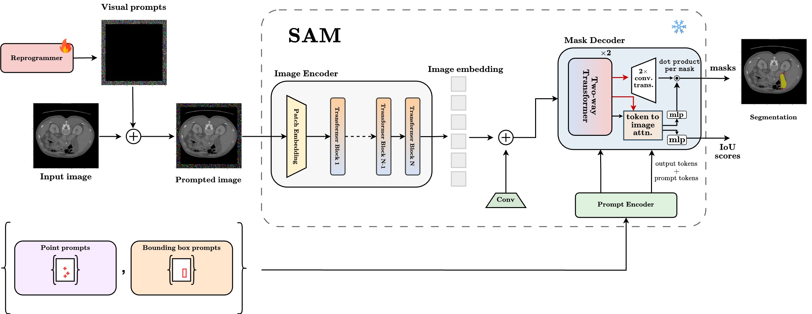

## Abstract
<p align="center">

</p>

>  As a foundation model,  the Segment Anything Model (SAM) has exhibited generalization capabilities across various benchmarks. However, we show that this capability diminishes rapidly when facing a considerable domain shift, particularly in medical imaging applications.  
Prior attempts to mitigate this shortcoming involved fine-tuning either the encoder or decoder of SAM or performing structural surgery by integrating custom adapter layers.
Focusing on medical image segmentation, we introduce RepSAM, a simple and effective method to reprogram SAM for downstream tasks.  RepSAM demonstrates an efficient method to utilize foundation vision models like SAM, maintaining their structural integrity and latent space, thereby fully leveraging their potential in tasks with significant domain shifts.
Our study addresses several key questions: *Q1.* How effective is reprogramming in comparison to fine-tuning or zero-shot generalization of SAM? *Q2*. We asked ourselves how many parameters are required to successfully reprogram SAM to perform a downstream task?.
*Q3.*  What are the implications of using model reprogramming in the medical imaging domain, particularly in scenarios with limited annotated data?
To answer *Q1*, we perform experiments on eight medical datasets with different modalities (eg,. CT and MRI) and show that on average, RePSAM outperforms previous art by a substantial gap of 22.6\% on mDice score. Addressing *Q2* and to our surprise, we found that SAM could be reprogrammed with as few as 0.19M parameters. Regarding *Q3*, we evaluate RepSAM on datasets that exhibit various challenges found in medical imaging, including limited data, imbalanced labels, multi-site data, and small objects. We empirically show that RepSAM is capable of adapting with as few as hundreds of examples indicating robustness and efficiency in learning from limited data.

<br/>

## Research Highlights
<p align="center">

</p>

* **Model Reprogramming for Segmentation Models:** We propose the adaptation of SAM through the lens of model reprogramming, a simple, lightweight method. SAM set training task for their model that involves predicting a set of valid masks for a given prompt to the model. To further improve the effectiveness of visual prompts, we condition the learning via bounding boxes encoded through the prompt encoder of SAM. Our work focuses on providing a simple system for effectively adapting SAM for medical image segmentation as a binary segmentation problem. We evaluate the models across diverse medical segmentation datasets
* **Evaluated on 8 Medical Segmentation Datasets:** `MSD-Heart`, `MSD-Spleen`, `MSD-Colon`, `MSD-Prostate`, `MSD-Hippocampus`, `Kvasir-SEG`, `ISIC`, `MedSAM2D`
<br/>
<hr/>

## Data preparation
* For MSD datasets, download the dataset from [Medical Segmentation Decathlon(MSD)](http://medicaldecathlon.com/) site.
* Set path of the dataset directory and run `python prepare_2D_data.py`. This will create train and test directories based on the label ids.using the `dataset.json` file from MSD. 
<br/>
* For MedSAM2d, download the [dataset](https://zenodo.org/record/7860267)  and unzip it. Process it to create gallbladder segmentation as described in [MedSAM](https://github.com/bowang-lab/MedSAM/tree/0.1).

* For ISIC, download the 2017 challenge datasets from [ISIC Challenge](https://challenge.isic-archive.com/data/#2017) site. 

Change the names of the directories containing images and the ground-trughts to ```images``` and `masks` respectively.

## Run

* Run the scripts provided in `/scripts` directory from the root directory.
```
sh scripts/run.sh
```
`run.sh` calls the the experiments with arguments:
```
# {1:datasets,2:rataset root,3:image extension, 4: label extension,5:padding size,6: label id}

sh scripts/exp.sh medsam2d MedSAMDemo_2D png png  16 0
```